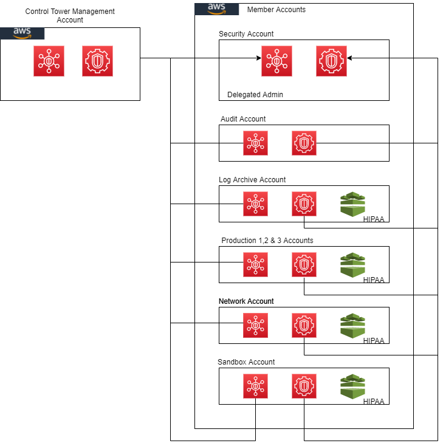

## Terraform Artifact

### Instructions
The code should be deployed for each account in the below order:

1.	Security
2.	Master
3.	Audit
4.	Log Archive
5.	Network
6.	Production Accounts (1, 2 & 3)
7.	UPN

Note: Teardown via Terraform should also follow an order as member accounts need to be disassociated from Security Hub & Guard Duty before destruction. Production & UPN accounts followed by Network, Log Archive, Audit, Master and then Security at the end.

The architecture diagrams (with .png extension) are included in the images folder for editing with [draw io](https://www.diagrams.net/) software.

### Security Hub, Guard Duty & HIPAA

Installing this customization will enable Security Hub & Guard Duty in all Control Tower managed accounts, with the Security account acting as the default Security Hub & Guard Duty Master. It also deploys HIPAA conformance pack in some of the accounts which consist of health information.
Security Hub & Guard Duty are regional services. The region selected for this deployment is us-east-1. Order of execution is important for this Terraform deployment. Both Security Hub & Guard Duty send out invites to all the member accounts (including the management account) in the control tower. All the accounts accept this invite via Terraform accepter. HIPAA conformance pack is the part of the config module deployed only in the test, development, production, log-archive, network & sandbox accounts.
The code also enables ebs encryption by default in all the accounts. Although both the standards: CIS benchmark & AWS foundational security best practices get enabled by default in Security Hub, the terraform code makes sure that it is reinforced in the security account. The master account delegates administrator to the security account so that all the findings from Security Hub & Guard Duty are consolidated & can be viewed in one account.

### Attributions

Config findings can be routed to Security Hub via a custom Lambda function. The procedure is included in this blog
https://aws.amazon.com/blogs/security/how-to-import-aws-config-rules-evaluations-findings-security-hub/

### Networking

A dedicated account (Network) is created in the Shared Services OU to host the shared resources such as Transit Gateway, VPN, Outbound VPC and Shared Services VPC (optional). 

#### Transit Gateway

A Transit Gateway is created in the Network account and is shared with the 'Prod' and 'Sandbox' OUs via AWS Resource Access Manager (RAM) so that the VPCs created in the accounts within those OUs can be attached to the Transit Gateway. A Transit Gateway route table is created for each OU and all the VPC attachments part of that OU are associated with that route table. The route tables are propagated with the VPC CIDRs such that any VPCs part of the 'Prod' OU can communicated with the Outbound VPC and Sandbox VPC but the VPCs within the 'Prod' OU can't communicate with each other. In addition, a VPN is created and attached to the Transit Gateway to establish communication with the on-premise network.

#### VPC

A VPC with a pair of subnets (App and DB subnet) across 3 AZs (6 subnets in total) is created in each accounts part of the 'Prod' and 'Sandbox' OUs. For the Outbound VPC, a public and a private subnet is created across 2 AZs (4 subnets in total). All the VPCs are attached to the Transit Gateway.

## Security

See [CONTRIBUTING](CONTRIBUTING.md#security-issue-notifications) for more information.

## License

This library is licensed under the MIT-0 License. See the LICENSE file.

